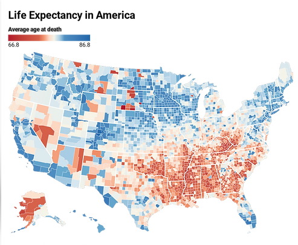

    <h1 style="font-size: 36px;">VENKATA SAI GAGAN DEEP ALUSURI</h1>

    📞 (656) 216-4402 | 📧 alusurigagandeep@gmail.com
     
    <a href="https://www.linkedin.com/in/gagandeepu562/">LinkedIn Profile</a> | <a href="https://gaganavs100.wixsite.com/gagandeepavs/">Portfolio Website</a> | Tampa, FL 33613

## EDUCATION

**University of South Florida, Tampa FL**
*Master of Science in Business Analytics and Information Systems*
*May 2024*

**Raghu Engineering College, Visakhapatnam, India**
*Bachelor of Technology, Computer Science and Engineering*
*September 2020*

## TECHNICAL SKILLSET

- **Languages**: SQL, Python (NumPy, Pandas, Matplotlib), R, Java, C, C++, React, C#, Javascript
- **Databases**: Microsoft SQL Server, MySQL.
- **Tools**: Tableau, Power BI, Power Point, Alteryx, SSIS, Excel, Word, AWS, Tensorflow, Pytorch, Sklearn, AzureML
- **Certifications**: SQL for Data Science, Visualizations with Tableau (Coursera 2022)
- **Skills**: Proficient in data engineering, cloud analytics, data visualization, data management, and data science with strong analytical abilities. Skilled in ETL processes, R/Python programming, effective communication, and collaborative teamwork.

## EXPERIENCE

**Infosys Limited, India**
*Data Analyst*
*December 2020 – April 2022*

- Analyzed and curated extensive datasets from diverse sources, ensuring data quality and enhancing usability for analysis.
- Conducted in-depth exploratory data analysis, leveraging advanced data visualization tools like Matplotlib and Seaborn, uncovering trends and insights crucial for business decision-making like sales analytics.
- Collaborated cross-functionally to develop and implement machine learning models, utilizing Python's scikit-learn and TensorFlow frameworks, addressing complex business challenges.
- Engineered impactful features from raw data, significantly boosting model performance and accuracy by up to 20%.
- Rigorously evaluated machine learning models, employing robust metrics and methodologies, certifying reliability and actionable insights.
- Maintained meticulous documentation of data sources, methodologies, and code, enabling seamless knowledge sharing and ensuring reproducibility to maintain data integrity.
- Effectively communicated intricate technical findings to team members and stakeholders through concise written and verbal presentations.

## PROJECTS

**Unveiling Disparities in Life Expectancy across US Counties: A Socio-Economic Analysis**

- Conducted an exhaustive analysis of life expectancy disparities across US counties, employing advanced statistical methods (Using R) such as multiple regression and multi-level modeling. Uncovered a substantial average decrease of 11.3 years in life expectancy nationwide.
- Determined statistically significant differences in life expectancy rates between various county-level socio-economic groups, including a 6.5-year gap between the highest and lowest quartiles.
 !(/assets/img/leimg.png)

**Forecasting Student Numbers at Feed-A-Bull Food Pantry**

- Utilized forecasting models to accurately predict student numbers with an average absolute percentage error of 3%, reducing the number of emergency food orders by 10% and making sure we can identify reasons for subscription renewal.
- Applied R, Facebook's Prophet, and ARIMA models to analyze four years of USF Feed-a-Bull pantry survey data (2018-2022), yielding a precise forecast of a 25% upsurge in future visitor numbers post-pandemic.
 

**Predictive Modeling for Customer Churn**

- Developed a predictive model using Python to identify factors contributing to customer churn for a retail client.
- Achieved an 85% accuracy rate in predicting customer churn, enabling proactive retention strategies.
- [Read the Paper](https://www.ijsdr.org/viewpaperforall.php?paper=IJSDR2006011)

**Data Visualization Dashboard on Commercial Corridors in St. Petersburg**

- Created an interactive data visualization dashboard using Tableau, presenting key performance metrics to support decision-making and to dissect business continuity trends in St. Petersburg's commercial corridors.
- Visualized trends, patterns, and correlations in client data, leading to actionable insights.

**Cloud-based Data Integration Project**

- Designed and implemented a cloud-based data integration solution to consolidate data from multiple sources, resulting in a 30% reduction in data processing time.
- Utilized AWS and Azure platforms for data storage and processing.
